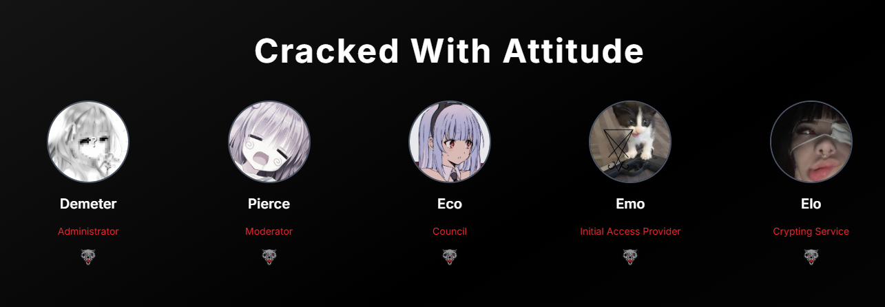

 

 
 
 

- Name: **Pierce** / **не совершай преступления**

- Residing in: **Somewhere in Pennsylvania**

- Field of Study: [**Digital Forensics**](https://www.ucf.edu/)

- Proficient in: **GNU/Linux** (Debian, Arch, Kali) and **FreeBSD** (pfSense, HardenedBSD)

- Skilled in: **JavaScript** & **TypeScript** (frontend & backend), **PHP** (Laravel, custom exploits), **Go** (network tools), and **Python** (automation, security scripts)

- Highly experienced with: **Docker** (containerized deployments), **Cloudflare** (security, WAF, bypass techniques), **Vercel** (serverless apps), and **CI/CD** (GitHub Actions, automated pipelines)

- Languages: Bahasa Indonesia, Russian, and English

 
 

 
 
  
- 📗 [***skidcore/ddos-discord***](https://github.com/skidcore/discord-bot-stresser)  
  DISCORD BOT FOR DDOS,, - Update Every 20 Minutes

 
 
“People with evil intent can do evil things without lying. And not all liars are evil.” – Elaina &nbsp;&nbsp;&nbsp;&nbsp;&nbsp;&nbsp;&nbsp;&nbsp;&nbsp;&nbsp;&nbsp;&nbsp;&nbsp;&nbsp;&nbsp;&nbsp;&nbsp;&nbsp;&nbsp;&nbsp;&nbsp;&nbsp;&nbsp;&nbsp;&nbsp;&nbsp;&nbsp;&nbsp;&nbsp;&nbsp;&nbsp;&nbsp;&nbsp;&nbsp;&nbsp;&nbsp;&nbsp;&nbsp;&nbsp;&nbsp;&nbsp;&nbsp;&nbsp;&nbsp;&nbsp;&nbsp;&nbsp;&nbsp;&nbsp;&nbsp;&nbsp;&nbsp;&nbsp;&nbsp;&nbsp;&nbsp;&nbsp;contact : lowsec@disroot.org
  

  

<!-- BADGES TOOLS/FEATURES -->

 
 
 

